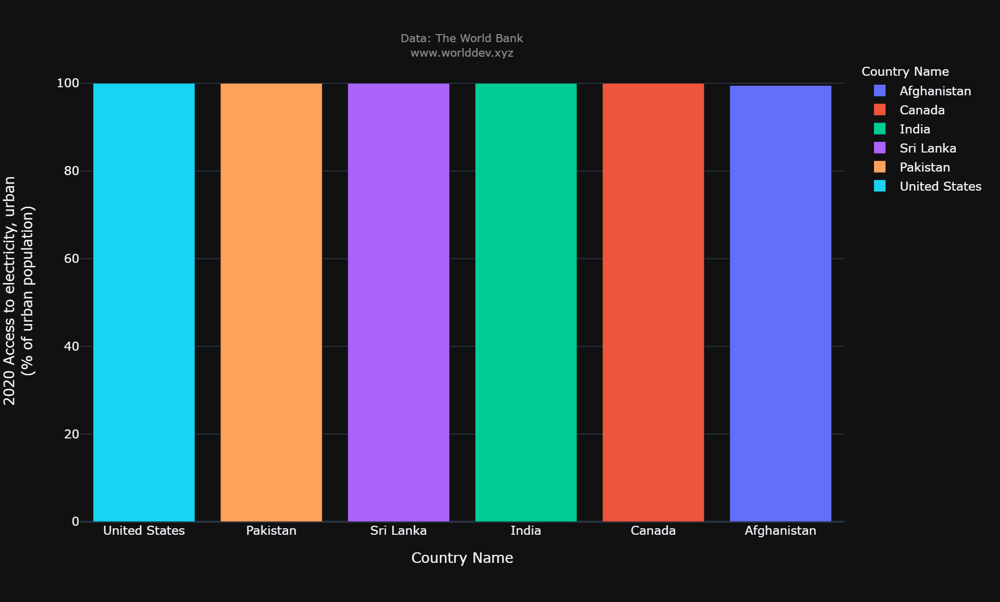

# Energy and Mining:
- Mining is primarily a source of the mineral products that all nations deem necessary for upholding and raising their levels of living. Construction of roads, hospitals, autos, homes, satellites, computers, and a variety of other consumer-favorite products and services all need the usage of mined materials.

# Importance:
- Modern life is impossible without electricity, which is also crucial to the economy of the nation. Electricity is used by people to run appliances, computers, electronics, machinery, and public transit systems as well as for lighting, heating, cooling, and refrigeration.
- I'd like to give a brief overview of energy and mining, including how much electricity is consumed, how much of the population uses electricity, and how much electricity is produced overall.

