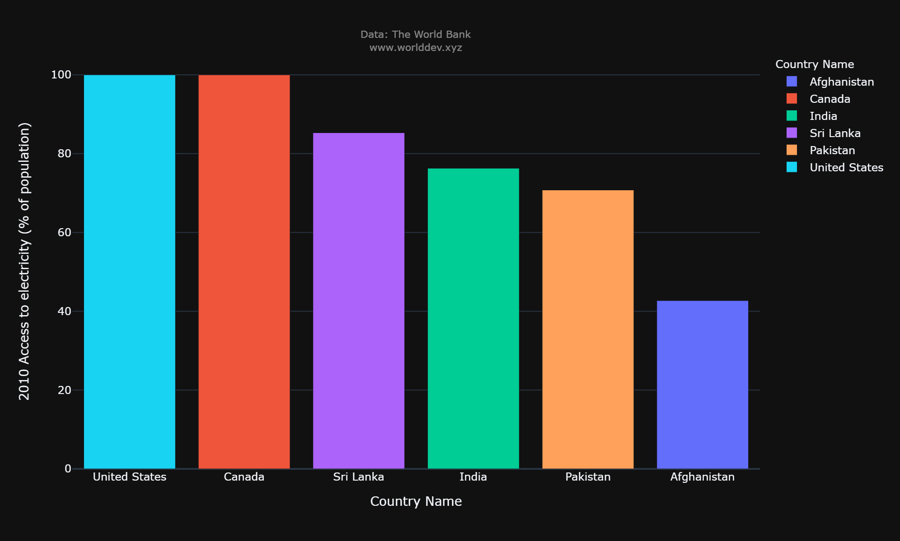
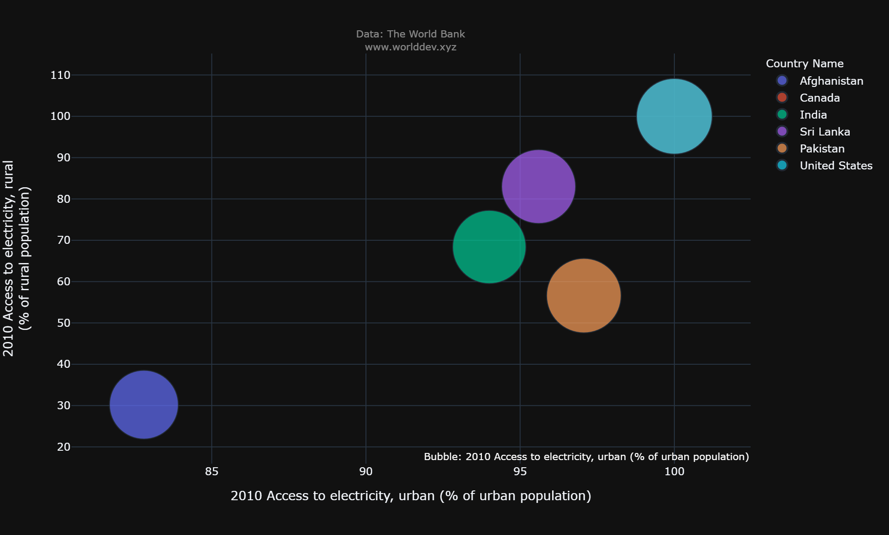
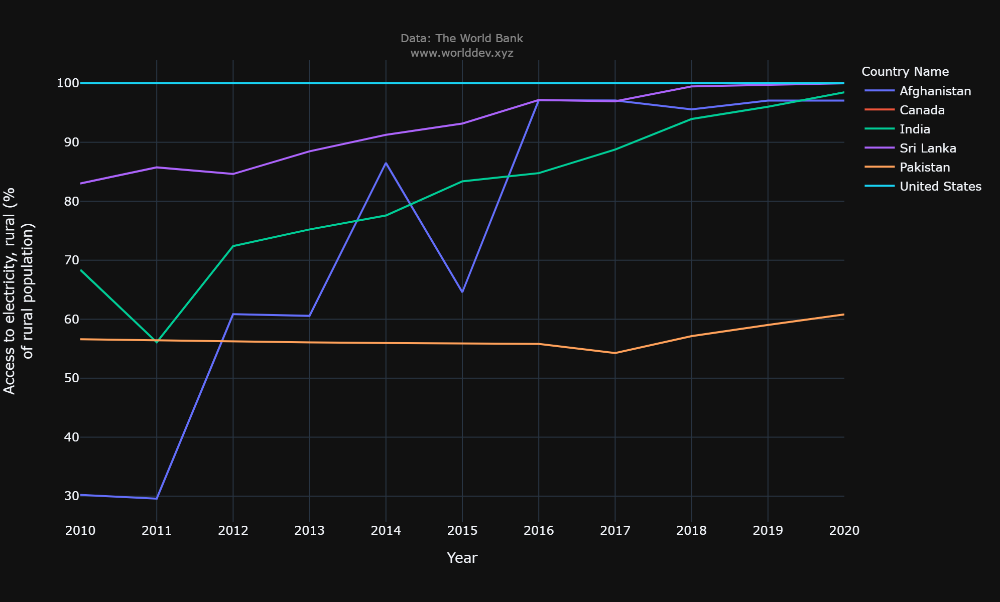
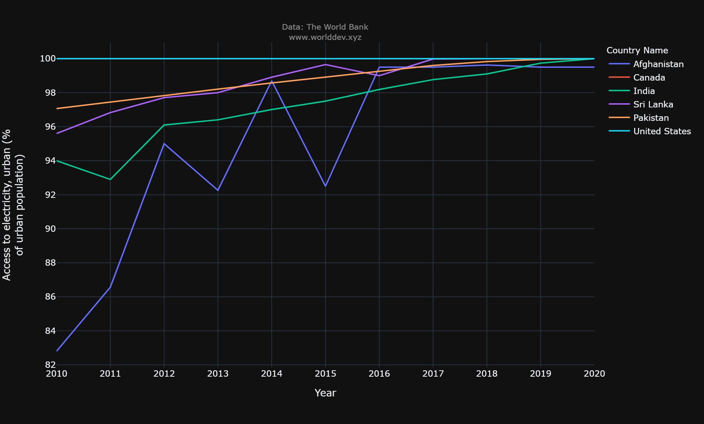
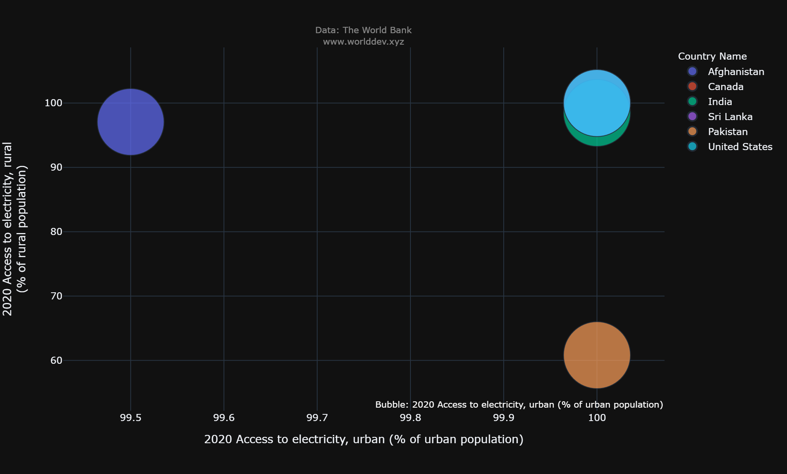
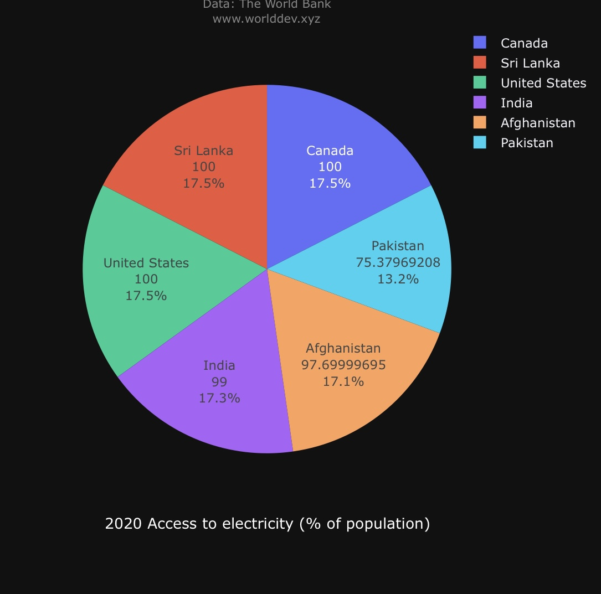

# Energy and Mining:
- Mining is primarily a source of the mineral products that all nations deem necessary for upholding and raising their levels of living. Construction of roads, hospitals, autos, homes, satellites, computers, and a variety of other consumer-favorite products and services all need the usage of mined materials.

# Importance:
- Modern life is impossible without electricity, which is also crucial to the economy of the nation. Electricity is used by people to run appliances, computers, electronics, machinery, and public transit systems as well as for lighting, heating, cooling, and refrigeration.
- I'd like to give a brief overview of energy and mining, including how much electricity is consumed, how much of the population uses electricity, and how much electricity is produced overall.

# Outlook:
- Using World Development Explorer, we can examine how much electricity is used globally [worlddev.xyz](https://www.worlddev.xyz/).

- Based on the previous ten years, the 6 countries namely Canada, United States, India, Pakistan, Sri Lanka and Afghanistan with the highest and lowest access to electricity are shown below '(2010-2020)' The World Bank

# Questions to be answered:
- The nations produce power from various energy sources and mines, but does the electricity reach every nook and cranny of every town and village?
- 
- wherein all nations are able to provide electricity for both urban and rural areas?
- 
- Does the ability of the countries to advance or decline during the decade?

# Analysis:
- Analysing the electricity rate of the countries Canada, United States, India, Pakistan, Sri Lanka.
- 
- Time period: 2010-2020

# 2010 Access to Electricity(% population):

- The bars in the data above represent the percentage of people who have access to electricity in 2010. 
- 
- The bars show that everyone of the population in Canada and the United States has access to electricity, whereas only 43 percent and 72 percent of the population, respectively, do so in Afghanistan and Pakistan. 
- 
- India and Sri Lanka in South Asia, however, have an accessible rate of 80%.

# Electricity accessibility of rural over urban(% population) in 2010:

- The scatter plot shows us the connection between the availability of power in urban areas and rural areas throughout the year 2010. Both Canada and the United States have complete accessibility to both sectors, which is why they are bubbling together at the top right.
- 
- Afghanistan has sadly fallen to the bottom left, indicating a poor accessibility rate for electricity throughout the period 2010 that is primarily caused by its rural population's inability to obtain it. 
- 
- With a 92 percent rate, Sri Lanka and India are making good progress and could rank among the top nations by the end of the decade. 
- 
- Given that its rural rate is not improving, Pakistan is only over average.

# Time Series of rural accessibility over the time period 2010 to 2020

- This line graph illustrates the change in access to electricity in rural areas between the years of 2010 and 2020. United States, Canada, and Pakistan are three countries that saw essentially little change in their accessibility rate over the course of the decade. 
- 
- The first two had a 100 percent accessibility rate, while the third had a dramatic 60 percent accessibility rate. 
- 
- Most intriguingly, Afghanistan's population increased from 30% to 98 percent throughout those 10 years, which is a success for the nation.

# Time Series of urban accessibility over the time period 2010 to 2020

- The line graph in this column provides evidence of the shift in metropolitan regions' availability to electricity from 2010 to 2020.
- 
- Even though there was no linear increase, there were multiple oscillations throughout the decade, it is apparent that Afghanistan had a significant growth from 80% at the beginning of the decade to about 98% by the conclusion of the decade. 
- 
- India alone experienced a strong climb from 94 to 99 with relatively few oscillations. Around the decade to 1998, Pakistan and Sri Lanka experienced a 3 percent linear increase. 
- 
- Over the course of a decade, Canada and the United States had a straight line with a 100% electrical provider.

# Electricity accessibility of rural over urban(% population) in 2020:

- The information about urban and rural accessibility in 2020 is shown in this scatter plot. Even in 2020, the United States and Canada will still be at the same percentage, so they will be included in the same bubble. 
- 
- Afghanistan's accessibility has steadily increased. While India and Sri Lanka made good progress during that time.
- 
- Given the emergence of other nations, Pakistan here couldn't be in the expected location.

# Pie chart display of the overall electricity accessed by the population of the countries:

- The pie chart clearly identifies the total amount of electricity that each country's population will use by 2020. Canada With complete accessibility throughout all of the countries, the United States and Sri Lanka are eating up the largest portions of the pie chart. 
- 
- India is only about 1% away from joining the top-ranking nations. Despite significant progress, Pakistan will still fall short of the 80 percent mark in 2020.

# Conclusion:
- Canada and the United States have led the pack overall over the past ten years.
- 
-  When compared to its enormously big population, India's accessibility rate experienced a very significant increase.
-  
-   Sri Lanka made some notable improvements at this time as well. Due to the fact that just 60% of Pakistan's rural residents had access to electricity at the end of the decade, the country bitterly experienced a horrible decade. 
-   
-   Most surprisingly, Afghanistan had the biggest growth in this area, with 98 percent of its rural population having access to electricity by the end of the decade, up from 30 percent at the beginning.
